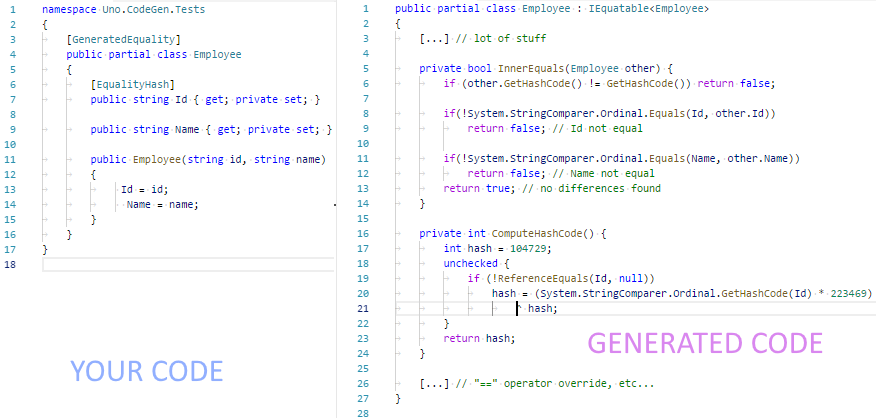

# Equality Members Generation



## Quick Start

1. Add a reference to the `Uno.CodeGen` _Nuget_ package in your project.
   [](https://www.nuget.org/packages/Uno.CodeGen/)
1. Create a new [POCO](https://en.wikipedia.org/wiki/Plain_old_CLR_object)
   class with the `[GeneratedEquality]` attribute
   ``` csharp
   [GeneratedEquality] // Uno.Equality.GeneratedEqualityAttribute
   public partial class MyEntity
   {
       [EqualityKey]
       public string Id { get; }

       [EqualityHash]
       public string A { get; }

       public string B { get; }

       [EqualityIgnore]
       public string C { get; }
   }
   ```

1. Compile (the generation process occurs at compile time).
1. It will generate the following public methods for you:
   ``` csharp
   partial class MyEntity : IEquatable<MyEntity>, IKeyEquatable<MyEntity>
   {
       // Global static helper for equality
       public static bool Equals(MyEntity a, MyEntity b)
       { ... }

       // IEquatable.Equals() implementation
       public bool Equals(MyEntity other)
       { ... }

       // override for object.Equals()
       public override bool Equals(MyEntity other)
           => Equals(other as MyEntity);

       // override for object.GetHashCode()
       public override int GetHashCode()
       { ... }

       // IKeyEquatable.KeyEquals() implementation
       public bool KeyEquals(MyEntity other)
       { ... }

       // IKeyEquatable.GetKeyHashCode() implementation
       public int GetKeyHashCode()
       { ... }

       // `==` Operator overload
       public static bool operator ==(MyEntity a, MyEntity b)
       { ... }

       // `!=` Operator overload
       public static bool operator !=(MyEntity a, MyEntity b)
       { ... }
   }
   ```
1. Use it in your code
   ``` csharp
   var e1_1 = new MyEntity {Id ="1", A="a", B="b", C="c"};
   var e1_2 = new MyEntity {Id ="1", A="a", B="b", C="c2"};
   var e1_3 = new MyEntity {Id ="1", A="a", B="b2", C="c2"};
   var e1_4 = new MyEntity {Id ="1", A="a2", B="b2", C="c2"};
   var e2 = new MyEntity {Id ="2", A="a2", B="b2", C="c2"};

   // All following asserts will pass:

   Assert.IsTrue(e1_1.Equals(e1_2));
   Assert.IsFalse(e1_1.Equals(e1_3));
   Assert.IsFalse(e1_1.Equals(e1_4));
   Assert.IsFalse(e1_1.Equals(e2));

   Assert.IsTrue(e1_1.KeyEquals(e1_2));
   Assert.IsTrue(e1_1.KeyEquals(e1_3));
   Assert.IsTrue(e1_1.KeyEquals(e1_4));
   Assert.IsFalse(e1_1.KeyEquals(e2));

   Assert.AreEquals(e1_1.GetHashCode(), e1_2.GetHashCode());
   Assert.AreEquals(e1_1.GetHashCode(), e1_3.GetHashCode());
   Assert.AreNotEquals(e1_1.GetHashCode(), e1_4.GetHashCode());
   Assert.AreNotEquals(e1_1.GetHashCode(), e2.GetHashCode());

   Assert.AreEquals(e1_1.GetKeyHashCode(), e1_2.GetKeyHashCode());
   Assert.AreEquals(e1_1.GetKeyHashCode(), e1_3.GetKeyHashCode());
   Assert.AreNotEquals(e1_1.GetHashCode(), e2.GetHashCode());

   ```

## KeyEquality? What is that?

It's simply a concept created by nventive to determine if the _key_ of
two entities are the same.

Suppose you have 2 versions of the same entity, an original version and
an updated version after a change. The two won't be equals because they
are representing different values, but they should be _key equals_ because
they have the same key (representing the same thing, just different versions
of it).


## How it works

1. The class needs to be partial - because generated code will augment it.
   If you want, you can sneak to generated code by checking in the following
   folder of your project: `obj/<target>/<platform>/g/EqualityGenerator`. Each
   class will have its own file there.
1. Restrictions:
   * **Only read-only fields/properties should be used**
     A warning will be generated when using mutable fields.
   * **Nested classes not supported**, the class must be directly in its
     namespace for the generation to happen.
1. **KeyEquality**:
   The _Key Equality_ is a feature to compare entities for the equality
   of their key(s). The main usage of this equality is to compare if
   different instances represent the same entity, even if they are a
   different version of it (let's say an updated version coming from the
   server, having the same unique key... instances will be _key equals_
   but not _equals_).
   * **To activate KeyEquality**, you need to have at least one field
     or property marked as _Equality Key_, or to derive from a type
	 implementing it.
   * When activated, this feature will generate:
     * The class that implements the `IKeyEquatable<T>` interface
     * The `.GetKeyHashCode()` & `.KeyEquals()` methods

     Those fields/properties WILL BE TREATED AS IF THEY WERE TAGGED EXPLICITLY.
   * You can put the `[EqualityKey]` attribute on more than one
     field/property.
1. **HashCodes**:
   _Hash Codes_ are used to quickly differentiate/categorize the object.
   * Computing _hash codes_ should be very quick.
   * For equivalent instances, the computed _hash code_
     **MUST PRODUCE THE SAME RESULT**.
   * **Hash Codes can't change over time** for the same instance (object).
     For this reason the computed result will be cached.
   * The _hash code_ will be computed from all fields/properties tagged with
     `[EqualityHash]` and those tagged with `[EqualityKey]`. The same logic
     will apply for _key equality_, but will only use those tagged with the
     `[EqualityKey]` attribute.
   * IMPORTANT: Tagging a _collection_ (ex: a `List` or an `Array` or any type
     implementing `ICollection`) with the `[EqualityHash]` attribute
     **will only use the `.Count` value for calculating the _hash code_.**
   * If nothing could be used to calculate the hash, the result will be
     hard-coded to zero (`0`).
1. **Operator overloading**:
   * Overloading of operations will be automatic, you have nothing to do
     to enable it.
   * There is no operator overloading (`==`/`!=`) for _Key Equality_.
1. Can be used on either a _value type_ (`struct`) or a _reference type_
   (`class`). When used with a `class`, a reference equality will be done.
1. If your code defines any of the generated methods, it will prevent the
   generator from generating this method. (actually, it will be generated,
   but the code will be commented-out, so you'll be able to sneak at it).
1. The comparer for a field can be overriden by specifying a
   `private static` read-only property named &lt;Field/Property name&gt; + "`_CustomComparer`"
   and of type `IEqualityComparer`
1. For `string`, a `StringComparer.Ordinal` will be used by default. If you
   need a different one you can specify a _custom equality comparer_.

## Equality Rules

For processing equality, the generation will generate many comparisons, in
this order:

1. If the type of the field/property is a collection (and not a `string`):
   1. A reference equality comparison will be done. If `equals`, it will return `true`. If one
      of them is `null`, it will return `false`. If both are `null`, it will return `true` since
      they are _reference equal_.
   1. The `.Count` will be compared (return `false` if `Count` is different)
   1. Each item of the collection will be compared by reapplying those rules.
1. **Custom Equality Comparer**: If there's a **Private**, **Static** &
   **Read-only** property with the name &lt;Field/Propertyname&gt;`_CustomComparer`
   of type `IEqualityComparer`, it will be used to compare the value. Example:
   ``` csharp
   public partial class Person
   {
       public string Name { get; }

       // Default comparer for `Name` property
       // Tip: You can create another .cs file to keep your entity "clean"
       private static IEqualityComparer Name_CustomComparer { get; } = StringComparer.Ordinal;
   }
   ```
1. If the type of the field/property is a string,
   `StringComparer.InvariantCulture` will be used.
1. The values will be compared using `EqualityComparer<T>.Default`.

The generation logic for fields/properties in the class, using a first-match rule...
* For `.Equals()`:
  1. If the tagged with `[EqualityIgnore]` attribute, won't be used in .Equals()
  1. All non-collection fields/properties will be evaluated **first**.
  1. The `.Count` of all collections will be checked **before** starting to
     enumerate them.
* For `.KeyEquals`:
  1. If not tagged with `[EqualityKey]` attribute, won't be used in .KeyEquals()
  1. Rules for `.Equals()` will apply.
* For `.GetHashCode`:
  1. Take all `[EqualityHash]` & `[EqualityKey]` fields/properties.
  1. If any of the type are a collection, only the `.Count` will be used to
     calculate a hash.
* For `.GetKeyHashCode`:
  1. Same as `.GetHashCode`, except only on `[EqualityKey]` attributes.

## Attributes

| Attribute | Where | Usage |
| -- | -- | -- |
| `[GeneratedEquality]` | `class` or `struct` | Use to trigger the code generation |
| `[EqualityIgnore]` | field or property | Remove a value from equality comparison |
| `[EqualityKey]` | field or property | Indicate values to use for key comparison** |
| `[EqualityHash]` | field or property | Indicate values to use for hash computation |

> About `[EqualityKey]` attribute:
> * Some field/property names could implicitly become _key equality member_
> * Members with `[EqualityKey]` (explicit or implicit) will also be considered
>   as `[EqualityHash]`.
> * Using the [Key] attribute from
>   [Data Annotations](https://www.nuget.org/packages/System.ComponentModel.Annotations)
>   will produce the same behavior.

## Important Considerations

* **Never rely on _Hash Code_ for persistence**: the computed result could
  be different when the application will be restarted. Hash codes should
  never _survive_ to the killing of the process.
* Remember: **Computing _hash codes_ should be quick**. It is better to have a
  quick computed value than a completely unique value. Colision should be avoided,
  but never as a result of a big computation. That's why only the length is used
  by default for collections.
* For best results, your class should be immutable. For this, you can use the
  [GeneratedImmutable] attribute. There is an optional parameter on this attribute
  to automatically generate equality members.

  Example: `[GeneratedImmutable(GenerateEquality = true)]`

  # FAQ

  ## Why am I getting the `warning CS0282`?
  The complete warning message is :
  ```
  warning CS0282: There is no defined ordering between fields in multiple declarations of partial struct '<mystruct>'. To specify an ordering, all instance fields must be in the same declaration.
  ```
  You have this warning because the generator is using partial declarations for a `struct`.
  If the layout is not important for your structs (mostly used for native interop), you
  can mute this warning in your project.

  You can also consider replacing the `struct` by a `class`.

  ## Are equality generation automatic for generated immutables?
  Yes they are by default. If you want to change this behavior, use the global
  `[ImmutableGenerationOptions]` attribute. Example:
  ``` csharp
  [assembly: Uno.ImmutableGenerationOptions(GenerateEqualityByDefault = true)]
  ```

  You can also override this default by specifying per-type:
  ```csharp
  [GeneratedImmutable(GenerateEquality = false)]
  public class MyImmutable
  {
  }
  ```
  > GOOD TO KNOW: The `[GenerateEquality]` attribute is _inheritable_. It means
  > any inherited class will be generated too, even if they are defined in another
  > assembly. (Assuming the `Uno.CodeGen` package is used, obviously)
