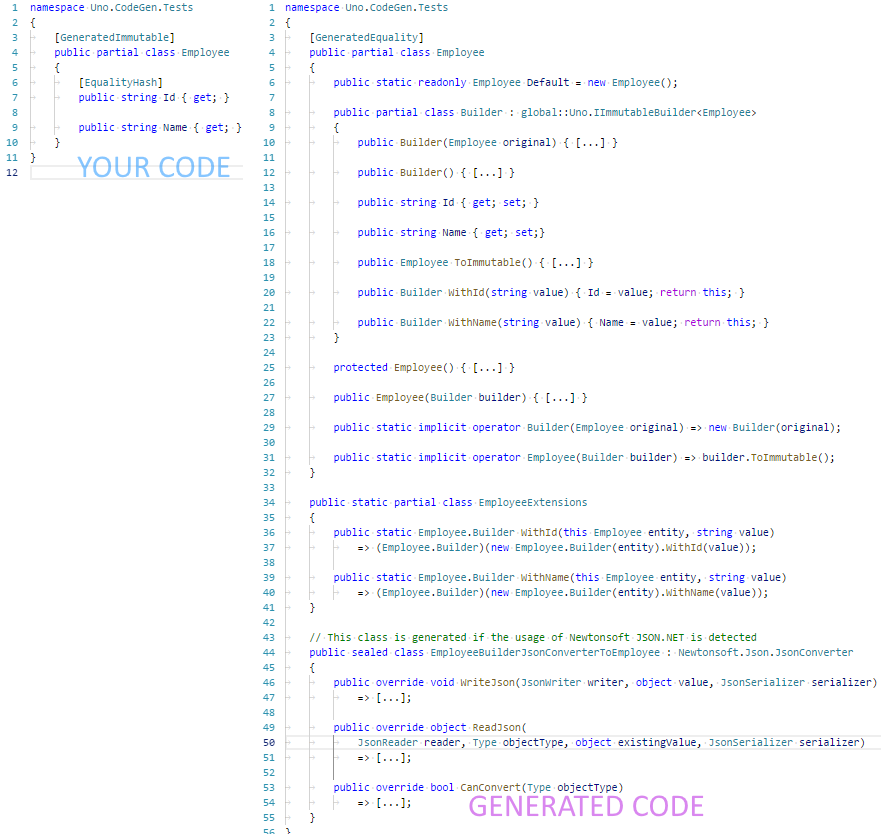

# Immutable Generation



## Quick Start

1. Add a reference to the `Uno.CodeGen` _Nuget_ package in your project.
   [](https://www.nuget.org/packages/Uno.CodeGen/)
1. Create a new [POCO](https://en.wikipedia.org/wiki/Plain_old_CLR_object)
   class with the `[GeneratedImmutable]` attribute
   ``` csharp
   [GeneratedImmutable] // Uno.GeneratedImmutableAttribute
   public partial class MyEntity
   {
       // Please take note all properties are "get-only"

       public string A { get; } = "a";

       public string B { get; } = "b";
   }
   ```
1. Compile (this is important to generate the partial portion of the class).
1. Use it in your code
   ``` csharp
   MyEntity entity1 = MyEntity.Default; // A="a", B="b"
   MyEntity entity2 = entity1.WithA("c"); // A="c", B="b"
   MyEntity entity3 = new MyEntity.Builder(entity2) { B="123" }; // A="c", B="123"
   MyEntity entity4 = MyEntity.Default
       .WithA("value for A") // Intermediate fluent value is a builder,
       .WithB("value for B"); // so there's no memory impact doing this.
   ```

## How to use it

1. The class needs to be partial - because generated code will augment it.
1. Restrictions:
   * **No default constructor allowed**
     (will with [Newtownsoft's JSON.NET](https://www.newtonsoft.com/json),
     or with [new .NET Core 3.0 API](https://devblogs.microsoft.com/dotnet/try-the-new-system-text-json-apis/) [System.Text.Json](https://docs.microsoft.com/en-us/dotnet/api/system.text.json?view=netcore-3.1)
     when detected, it will generate custom JSON Converter. You can disable
     this globally by setting this attribute:
     `[assembly: ImmutableGenerationOptions(GenerateNewtownsoftJsonNetConverters=false, GenerateSystemTextJsonConverters=false)]`
   * **No property setters allowed** (even `private` ones):
     properties should be _read only_, even for the class itself.
   * **No fields allowed** (except static fields, or `readonly` fields of a recognized immutable type).
   * **No _write_ indexers** read-only indexers are ok and sometime useful for complex types.
   * **Static members are ok**, as they can only manipulate immutable stuff.
     Same apply for extensions.
   * **Nested classes not supported**, the class must be directly in its
     namespace for the generator to happen.
1. Property Initializers will become default values in the builder.
   ex:
   ``` csharp
   public partial class UserPreferences
   {
        // Each time a new version of the builder is created
        // the initializer ("DateTimeOffset.Now" here) will be
        // applied first.
        public DateTimeOffSet LastChange { get; } = DateTimeOffset.Now;
   }
   ```
   **Warning: don't use this for generating an id like a _guid_, because time you'll
   update the entity you'll get a new id.**

   * Properties with implementation will be ignored (also called _computed property_).

     Example:
     ``` csharp
     /// <summary>
     /// Gets the fullname of the contact.
     /// </summary>
     public string FullName => LastName + ", " + FirstName;
     ```
   * Generated builder are implicitly convertible to/from the entity
   * Collections must be IReadOnlyCollection, IReadonlyDictionary or an
     immutable type from System.Collection.Immutable namespace:
     ImmutableList, ImmutableDictionary, ImmutableArray, ImmutableSet...
     **The type of the collection must be immutable too**.
1. A static `.Default` readonly property will contain a default instance with
   properties to their default initial values.

   It can be used as starting point to create a new instance, example:
   ``` csharp
   Invoice invoice = Invoice.Default
       .WithId(invoiceId)
       .WithCustomer(customer)
       .WithItems(items);
   ```

## Usage

``` csharp
// No default constructor allowed on [Immutable] classes
var x = new MyEntity() ; // Won't compile

// Method 1: Creating a builder from its constructor
MyEntity.Builder b = new MyEntity.Builder();

// Method 2: Creating a builder using implicit cast
MyEntity myEntity = [...];
MyEntity.Builder b = myEntity;

// Method 3: Creating a builder using .WithXXX() method
MyEntity myEntity = [...];
MyEntity.Builder b = myEntity.WithName("new name");

// Method 4: You can also create a builder from a previous version
MyEntity.Builder b = new MyEntity.Builder(previousEntity);

// To get the Immutable entity...

// Method 1 : Use implicit conversion (MyEntity.Builder => MyEntity)
MyEntity e = b;

// Method 2 : Use the .ToImmutable() method
MyEntity e = b.ToImmutable();

// Method 3 : Use the generated constructor with builder as parameter
MyEntity e = new MyEntity(b);
```

## `.WithXXX()` helpers

All set+set properties will also generate a `With<propertyName>()` method.
The method will take a parameter of the type of the corresponding property.
This method is present on both the class and the builder and always
returns a builder.

Usage:

``` csharp
public partial class MyEntity
{
    public string A { get; } = string.Empty;
    public string B { get; } = null;
}

[...]

// Create a first immutable instance
var v1 = new MyEntity.Builder { A="a", B="b" };

// Create a new immutable instance
var v2 = v1
    .WithB("b2")
    .ToImmutable();

// Same as previous but with the usage of implicit conversion
MyEntity v2bis = v1.WithB("b2");
```

You can also use a lambda to project a property value. This is very
useful for object hierarchy:

``` csharp
public partial class MyEntity
{
    public MySubEntity A { get; } = null;
}

public partial class MySubEntity
{
    public string X { get; } = null;
}

var original = MyEntity.Default;
var modified = original.WithA(a => a.WithX("!!!"); // won't generate null-ref exception!
```


## Aggregates (graph of objects/classes)

Let's say we write this...

``` csharp
[Immutable]
public partial class MyRootEntity
{
    public string A { get; }
    public MySubEntity B { get; }
}

[Immutable]
public partial class MySubEntity
{
    public string C { get; }
    public string D { get; }
    public ImmutableList<string> E { get; }
}
```

This will generate something like this:

``` csharp
[Immutable]
public partial class MyRootEntity
{
    public partial class Builder
    {
        public string A { get; set; }
        public MySubEntity B { get; set; }
    }
}

[Immutable]
public partial class MySubEntity
{
    public partial class Builder
    {
        public string C { get; set; }
        public string D { get; set; }
    }
}
```

Important:

* Complex properties \*\***MUST**\*\* be immutable entities.
  A complex property is when it's a defined type, not a CLR primitive.
* Indexers are not supported.
* _Events Properties_ are not supported.

# Relation with `Uno.Core` package & `Option<T>`
The generator will automatically detect the presence of the package `Uno.Core`
to generate helper methods for working with `Option<T>`.

When `Uno.Core` is detected, the following code will be generated additionally:
* A new static `T.None`
* An automatic conversion from `Option<T>` to `T.Builder`.
* An automatic conversion from `T.Builder` to `Option<T>`
  (producing `Option.None` when the instance is `default(T)`)
* Extensions methods for _.WithXXX()_ on `Option<T>`.

The generated code will produce the following effect:
  ``` csharp
  using Uno;

  // Without `Option` generated code:
  Option<MyEntity> original = Option.Some(MyEntity.Default);
  Option<MyEntity> modified = new MyEntity.Builder(original.SomeOrDefault()
      .WithA("new-a")
      .ToImmutable();

  // With generated code:
  Option<MyEntity> original = Option.Some(MyEntity.Default);
  Option<MyEntity> modified = original.WithA("new-a");

  // You can also do that:
  Option<MyEntity> x = MyEntity.None.WithA("new-a");
  // **************************************************************
  // IMPORTANT: Calling .WithXXX() methods on a `None` will convert
  // it to `Default`. So MyEntity.None.WithA() produce the exact
  // same result as MyEntity.Default.WithA().
  // **************************************************************
  ```

> For more information on the `Uno.Core` package:
> * On Github: <https://github.com/unoplatform/Uno.Core>
> * On Nuget: <https://www.nuget.org/packages/Uno.Core/>

# FAQ

## What if I need to use it with [Newtownsoft's JSON.NET](https://www.newtonsoft.com/json) or with [System.Text.Json](https://docs.microsoft.com/en-us/dotnet/api/system.text.json?view=netcore-3.1)?
You simply need to deserialize the builder instead of the class itself.
The implicit casting will automatically convert it to the right type.

Example:
``` csharp
  MyEntity e1 = Newtonsoft.Json.JsonConvert.DeserializeObject<MyEntity.Builder>(json);
  MyEntity e2 = System.Text.Json.JsonSerializer.Deserialize<MyEntity.Builder>(json);
```

## It's generating a lot of unused method. It's a waste.
For most application the compiled code won't be significant. Assets
in projects are usually a lot bigger than that.

If you are using a linker tool
([Mono Linker](http://www.mono-project.com/docs/tools+libraries/tools/linker/) /
[DotNetCore Linker](https://github.com/dotnet/core/blob/master/samples/linker-instructions.md)),
those unused methods will be removed from compiled result.

We think the cost of this unused code is cheaper than the potential
bugs when writing and maintaining this code manually.

## What is the usage of the `[Immutable]` and `[ImmutableBuilder]` attributes?
* **ImmutableAttribute**:
  The `[Immutable]` is used by other parts of _Uno_
  (some are not published as opened source) to identify an entity has been
  immutable.
* **ImmutableBuilderAttribute**:
  The `[ImmutableBuilder]` is used to indicate which class to use to build
  the target immutable type. The builder is expected to implement
  the `IImmutableBuilder<TImmutable>` interface.

If you want, you can manually create immutable classes and use those
attributes in your code: the code generators will use it as if it was
generated.

## Are immutable entities thread-safe?
Yes! That's the major aspect of immutable entities. Once an instance
of an immutable class is created, it's impossible to change it.
(ok, it's possible by using reflection, but why would you do that?)

But the builders are not thread safe. That means updating the same
property of the same instance concurrently (from many threads) will
produce unexpected result.

## Can we reuse builders?
Yes. You can continue to update the builder even after calling
`.ToImmutable()`. The created instance won't be updated.

## What is the usage of the [Pure] attribute on some methods?
This attribute is used to indicate a _pure method_. It means a method
having no side effect.

Since calling a _pure method_ without using the result is a waste
of resources, some IDE tools like [ReSharper(TM)](https://www.jetbrains.com/resharper/)
will give you a visual warning when you're not using the result.

## Can I create a nested immutable types?
Not supported yet. Open an issue if you need this.

## Can I use this for value types? (`struct`)
No. The type must be a reference type (`class`).

## What is happening with attributes on my properties?
All attributes are replicated, except those defined in `Uno.Immutables` and
`Uno.Equality`. If you need to remove other attributes, you just need
to use the `[ImmutableAttributeCopyIgnore(<regex>)]` attribute.

For a finer control, you can put it at assembly level, on a type or
even on a property itself.

## What about arrays? They are not immutables
Exactly, arrays are not immutable. But they have one big advantages over other
declarations: they are _great looking_. Declaring a property as `A[]` is
more concise than declaring `IReadonlyCollection<T>`.

You should not use arrays for immutable types, but if you really prefer the
concise declaration of arrays, you can allow arrays to be treated as immutables
by setting this attribute on your assembly:

``` csharp
[assembly: Uno.ImmutableGenerationOptions(TreatArrayAsImmutable = true)]
```

## Are equality generation automatic for generated immutables?
Yes they are by default. If you want to chagne this behavior, use the global
`[ImmutableGenerationOptions]` attribute. Example:
``` csharp
[assembly: Uno.ImmutableGenerationOptions(GenerateEqualityByDefault = true)]
```

You can also override this default by specifying per-type:
```csharp
[GeneratedImmutable(GenerateEquality = false)]
public class MyImmutable
{
}
```
> GOOD TO KNOW: Both `[GeneratedImmutable]` and `[GeneratedEquality]` attributes
> are _inheritable_. It means > any inherited class will be generated too,
> even if they are defined in another assembly
> (Assuming the `Uno.CodeGen` package is used, obviously).
> So, disabling equality generation
> (`[GeneratedImmutable(GenerateEquality = false)]`)
> won't have any effect in inherited class if the generation is active on the
> base class.

## I want to reference external classes from my entities.

I'm getting this error:

``` csharp
#error: 'ImmutableGenerator: Property MyClass.SomeField (BaseClass) is not immutable. It cannot be used in an immutable entity.'
```

To fix this, put this attribute on your assembly:

``` csharp
[assembly: Uno.TreatAsImmutable(typeof(BaseClass))]
```
